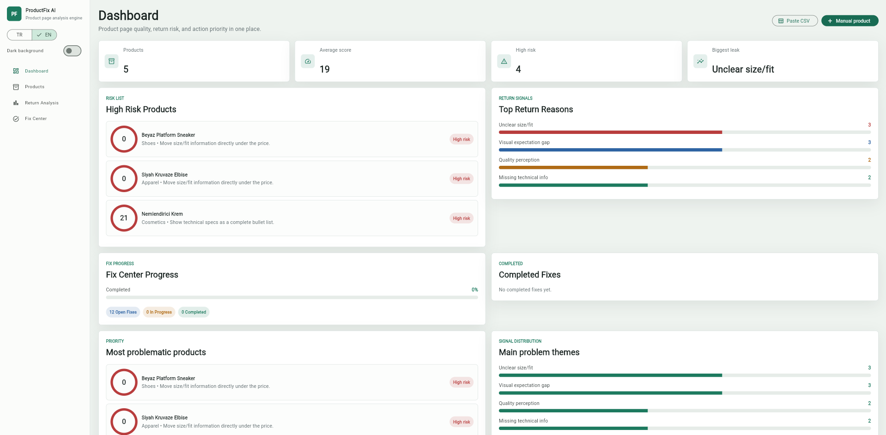
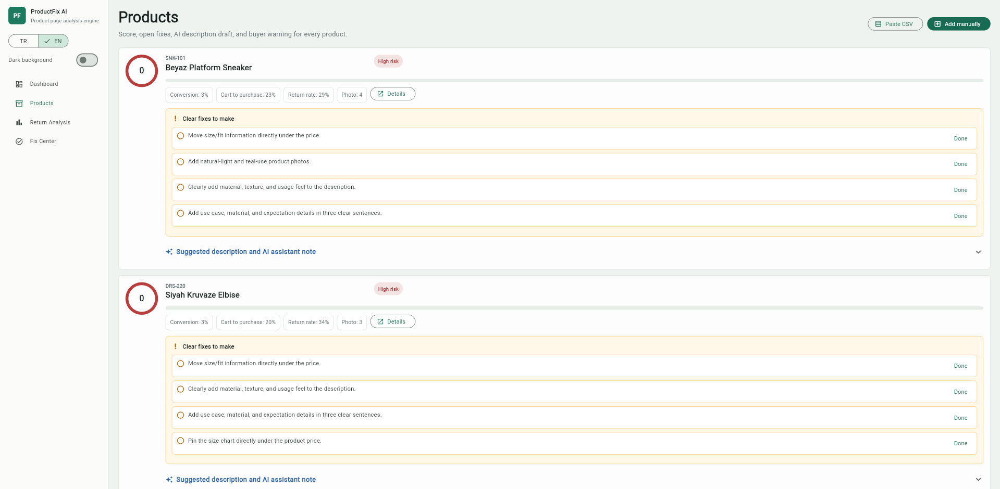
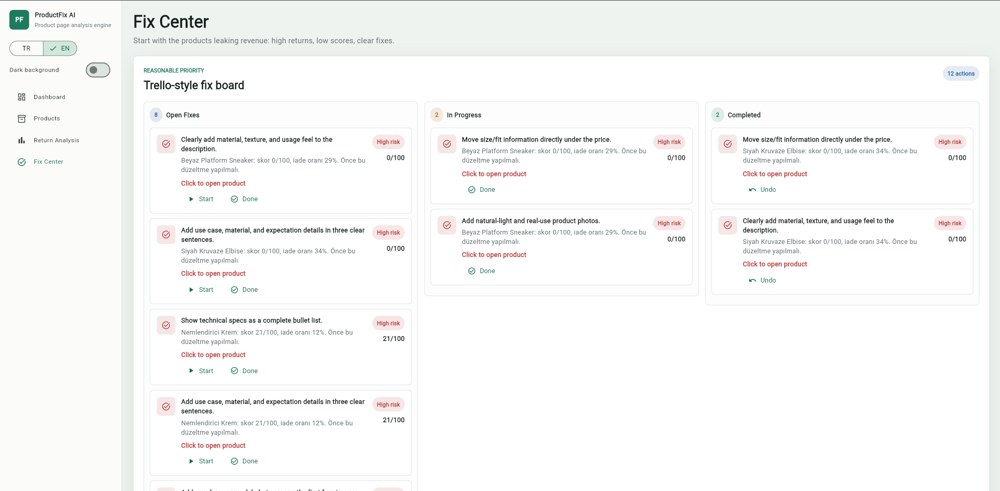

# ProductFix AI

ProductFix AI is a SaaS-style MVP for ecommerce teams that want to understand why products are not converting, why customers return them, and what should be fixed first.

## Problem

E-commerce mağazalarında bazı ürünler çok görüntülenir ama sepete eklenmez, bazıları satılır ama çok iade edilir. Mağaza sahipleri bunun nedenini manuel yorumlardan, iade sebeplerinden ve ürün sayfası eksiklerinden anlamaya çalışır.

## Solution

ProductFix AI, ürün verilerini analiz ederek düşük dönüşüm ve yüksek iade riskine sahip ürünleri bulur. Ürün açıklaması, yorumlar, iade sebepleri, fotoğraf sayısı, beden tablosu gibi sinyalleri kullanarak mağaza sahibine uygulanabilir düzeltme önerileri sunar.

The app turns raw product CSV data into:

- Product risk scores
- Return reason analysis
- Missing product page signal detection
- Rule-based analysis and AI-ready product fix suggestions
- A Fix Center where actions can be marked as completed
- Tenant-specific persistent databases for SaaS customers

## Screenshots

### Dashboard



### Product Risk List



### Fix Center



## Demo Flow


## Features

- Dashboard for conversion, return, and risk signals
- Dashboard demo panels for High Risk Products, Top Return Reasons, Fix Center Progress, and Completed Fixes
- Products view with per-product improvement recommendations, risk badges, and detail previews
- Product detail modal with before/after description preview
- Return analysis with category and theme breakdowns
- Trello-style Fix Center with Open Fixes, In Progress, and Completed columns
- Completed fix tracking that survives page reloads
- CSV paste input and manual product entry
- Turkish / English UI language switch
- Light / dark background mode
- Tenant-specific SQLite databases under `backend/data/tenants/`
- Two backend analysis modes: `rule_based` and `llm_powered`

## Project Layout

- `frontend/`: Flutter app
- `backend/`: Python FastAPI analysis service
- `backend/productfix/api.py`: thin API routing layer
- `backend/productfix/analysis.py`: rule-based analysis engine
- `backend/productfix/ai_suggestions.py`: LLM-ready suggestion layer
- `backend/productfix/schemas.py`: API request and mode schemas
- `backend/productfix/services/product_service.py`: CSV import and tenant product workflows
- `backend/productfix/services/analysis_service.py`: analysis mode orchestration
- `backend/productfix/services/fix_service.py`: completed fix workflows
- `backend/productfix/storage.py`: SQLite persistence layer
- `backend/data/sample-products.csv`: demo CSV file

No virtualenv is created by this repo. Use your own conda environment.

## Quick Start

### Backend

```powershell
cd backend
pip install -r requirements.txt
uvicorn productfix.api:app --reload
```

For local development and tests, install the dev dependencies:

```powershell
cd backend
pip install -r requirements-dev.txt
```

Run the sample analysis without starting the API:

```powershell
cd backend
python -m productfix.sample_run
```

### Frontend

Flutter is expected to be available in your environment.

```powershell
cd frontend
flutter pub get
flutter run
```

## Demo Data

Use `backend/data/sample-products.csv` as the starting template.

Required columns:

- `sku`
- `name`
- `category`
- `views`
- `add_to_cart`
- `purchases`
- `returns`
- `description`
- `reviews`
- `return_reasons`
- `photo_count`
- `has_size_chart`
- `has_model_photo`

## SaaS Persistence

The API persists uploaded CSV data per SaaS customer. Each `tenant_id` gets its own SQLite database under `backend/data/tenants/`, so customers do not have to upload the same CSV again.

The backend currently allows all CORS origins for MVP convenience. Restrict this in production, ideally by reading the allowed frontend origin from an environment variable such as `FRONTEND_ORIGIN`.

Useful endpoints:

- `POST /tenants/{tenant_id}/products/import-csv`: import or update products from a CSV file, then return the tenant analysis.
- `GET /tenants/{tenant_id}/products`: list the products already stored for that tenant.
- `GET /tenants/{tenant_id}/analysis`: analyze the tenant's stored products without uploading another CSV.
- `POST /tenants/{tenant_id}/fixes/{fix_id}/complete`: mark a fix as completed or reopen it with `{ "completed": false }`.
- `GET /tenants/{tenant_id}/fixes/completed`: list completed fixes.

## Analysis Modes

ProductFix AI supports two backend analysis modes:

- `rule_based`: deterministic scoring based on conversion, return rate, issue keywords, and missing product page signals.
- `llm_powered`: keeps the rule-based score, then attaches structured AI-ready suggestions through `ai_suggestions.py`.

Currently, the LLM-powered mode uses a local stub. It does not call a real LLM yet; `generate_ai_fix(product)` packages the existing `suggested_description` and `buyer_warning` fields into the same response shape the frontend expects. This keeps the demo runnable without external API keys while making the architecture ready for OpenAI, Gemini, Ollama, Hugging Face, or another LLM provider.

A future provider switch can use an environment variable such as:

```env
AI_PROVIDER=stub
AI_PROVIDER=openai
AI_PROVIDER=ollama
```

That would let the same analysis flow stay in place while swapping the implementation behind `generate_ai_fix(product)` for a free local model, a hosted model, or a stronger paid provider.

Example:

```powershell
curl.exe "http://127.0.0.1:8000/tenants/demo-store/analysis?analysis_mode=llm_powered"
```

## API Smoke Test

After starting the backend, upload the sample CSV for a demo tenant:

```powershell
curl.exe -X POST "http://127.0.0.1:8000/tenants/demo-store/products/import-csv" `
  -F "file=@backend/data/sample-products.csv"
```

## Tests

Backend tests cover the rule-based analysis engine, tenant storage, and FastAPI endpoints.

```powershell
cd backend
pip install -r requirements-dev.txt
python -m pytest
```
